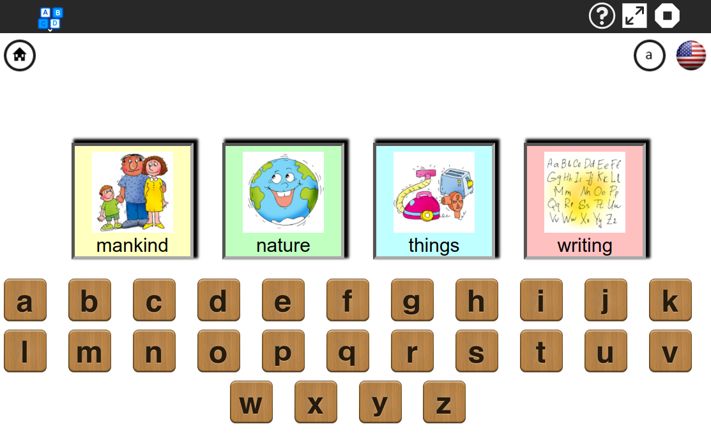
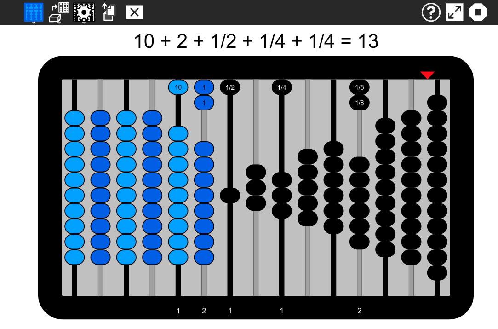
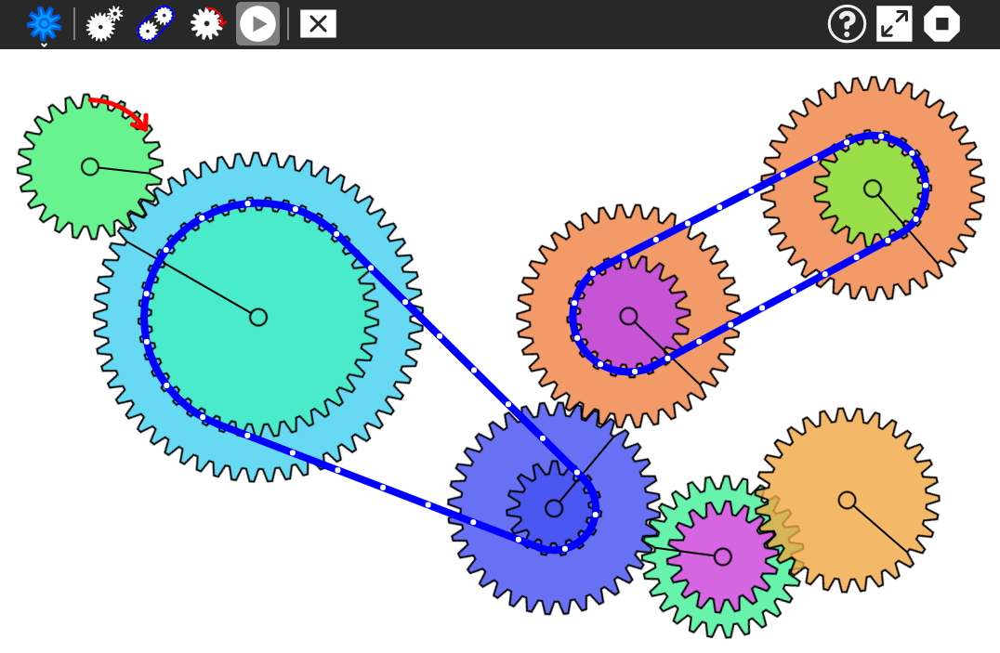
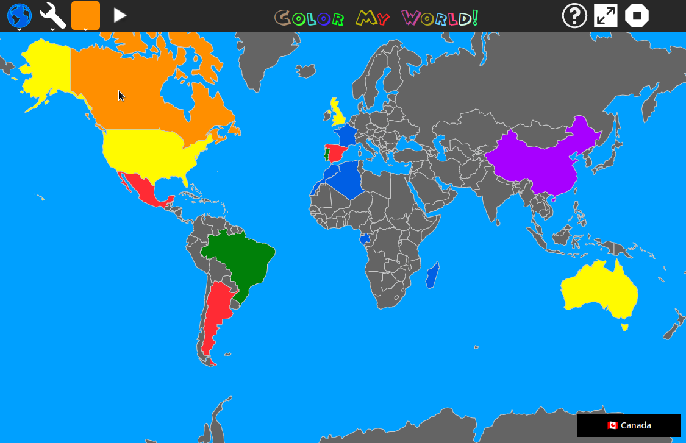
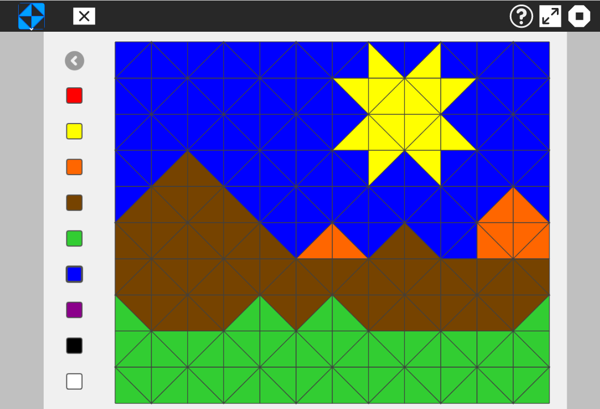
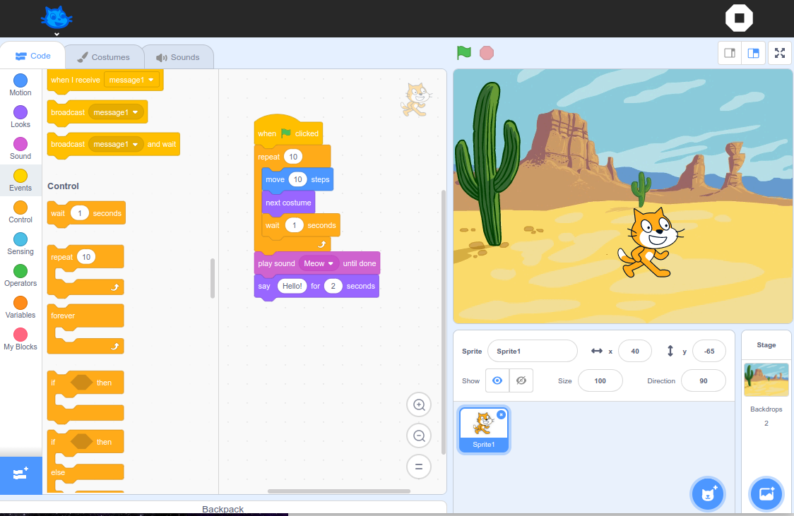

# Les apprentissages fondamentaux avec Sugarizer

La force de la plateforme Sugarizer est qu'elle permet de faciliter l'enseignement des apprentissages fondamentaux de l'école primaire. Découvrons comment.

## Quels sont les apprentissages fondamentaux ?

Les apprentissages fondamentaux enseignés à l'école primaire varient d'un pays à l'autre, mais en général, ils couvrent un certain nombre de domaines clés pour le développement des compétences de base chez les élèves. 
En voici quelques-uns sur lesquels Sugarizer peut être utile :
* Lecture et écriture
* Mathématiques
* Sciences et simulation
* Géographie et exploration
* Éducation artistique
* Informatique et programmation

## Lecture et écriture
L'alphabétisation est l'un des piliers essentiels de l'éducation primaire. Les élèves apprennent à reconnaître, lire et écrire des lettres, des mots et des phrases. Ils développent également leur compréhension de la lecture et apprennent à s'exprimer par écrit.

Sugarizer propose un certain nombre d'activités pour la lecture et l'écriture, notamment :
* **Abecedarium**: Une activité abécédaire pour apprendre l'alphabet en utilisant des images, des sons et des mots.	
* **Speak**: Ue tête qui parle où tout ce que l'enfant écrit va être dit à haute voix par le synthétiseur vocal.
* **Calligra**: Une activité pour aider les enfants à apprendre l'écriture cursive.	
* **Falabracman**: Un jeu simple pour apprendre les mots en récupérant les lettres dans le bon ordre.
* **Ebook Reader**: Un lecteur de livre électronique pour lire un ensemble de livres de la littérature classique.		
* **Story**: Une activité pour raconter une histoire à partir d'un ensemble d'images.	
* **Write**: Un traitement de texte basique avec une interface adaptée aux enfant.

## Mathématiques
Les mathématiques de base sont enseignées, y compris les opérations mathématiques telles que l'addition, la soustraction, la multiplication et la division, ainsi que les concepts de base tels que les nombres, les fractions, les décimales et la géométrie.

Sugarizer propose un certain nombre d'activités pour les mathématiques, notamment :
* **Abacus**: Explorer la représentation des nombres en utilisant différent types de bouliers.
* **Fraction**: Un jeu pour apprendre les fractions. 
* **MindMath** : Un jeu de calcul mental similaire au compte est bon. 
* **Reflection** : Un jeu pour apprendre la symétrie horizontale et verticale.
* **Tank Operation** : Un jeu où il faut détruire les tanks ennemis en résolvant des opérations mathématiques.
* **Calculate** : Une calculatrice qui propose les fonctions les plus simples mais aussi des fonctions complexes et du tracé de courbes.

## Sciences et simulation
Les élèves sont initiés aux concepts scientifiques fondamentaux, tels que les propriétés de la matière, les forces et le mouvement, les animaux et les plantes, les phénomènes naturels, etc.

Sugarizer propose un certain nombre d'activités pour les sciences et la simulation, notamment :
* **Clock Web** : Une activité simple pour apprendre à lire et dire l'heure.
* **Physics JS** : Un simulateur du monde physique pour voir comment s'exerce la gravité et l'inertie.
* **Gears** : Un outil pour explorer la manière dont les engrenages et les chaînes transmettent le mouvement. 
* **Measure** : Une activité pour apprendre les concepts physiques du son.
* **FoodChain** : Une activité pour apprendre le noms des animaux et le concept de chaîne alimentaire.
* **Game of Life** : Un jeu pour observer et explorer les interactions des cellules et leur évolution génération après génération. 

## Géographie et exploration 
Les élèves apprennent les bases de la géographie, les différentes cultures et explorent le ciel et le système solaire.

Sugarizer propose un certain nombre d'activités pour la géographie et l'exploration, notamment :
* **Color My World** : Une activité pour explorer le monde et ses pays.
* **Dollar Street** : Une activité pour découvrir comment les gens vivent dans les différents pays en fonction de leur revenu mensuel.
* **Moon** : Une activité pour visualiser les phases de la Lune.
* **Planets** : Une activité pour explorer les planètes du système solaire.
* **Constellation** : Un planétarium pour voir le ciel tel qu'il est depuis n'importe quelle endroit sur Terre.

## Éducation artistique
Cela peut inclure des activités artistiques comme le dessin, la peinture et la musique, visant à développer la créativité et l'expression personnelle.

Sugarizer propose un certain nombre d'activités pour aider les élèves à développer leurs compétences artistiques, notamment :
* **Grid Paint** : Une activité de dessin simple qui permet aux enfants de dessiner en utilisant une grille de triangles.
* **Paint** : Une activité pour créer des peintures et dessins. 
* **Record** : Un outil simple pour capturer des photos, vidéos et/ou audios depuis votre machine.
* **FotoToon** : Une activité pour créer une bande dessinée à partir de vos photos, dessins et images.
* **TamTam Micro** : Une activité pour jouer des instruments, sons et bruits de différents types.

## Informatique et programmation
De plus en plus, les écoles intègrent des notions d'informatique et de technologie à l'éducation primaire pour familiariser les élèves à la programmation.

Sugarizer propose un certain nombre d'activités pour aider les élèves à développer leurs compétences en informatique et en programmation, notamment :
* **Scratch** : Un environnement complet pour programmer des histoires interactives, jeux et animations.
* **Turtle Blocks JS** : Une activité inspirée du Logo qui permet de dessiner des éléments colorés et les combiner via des éléments de programmation visuel.
* **Jappy** : Un environnement d'exécution pour apprendre le langage de programmation Python.

## En savoir plus

* Une liste des activités de Sugarizer avec une démonstration de leur utilisation est accessible [ici](https://sugarizer.org/activities.html).
* Vous pouvez tester en ligne Sugarizer [ici](https://try.sugarizer.org) ou le télécharger [ici](https://sugarizer.org/index.html#apps).
