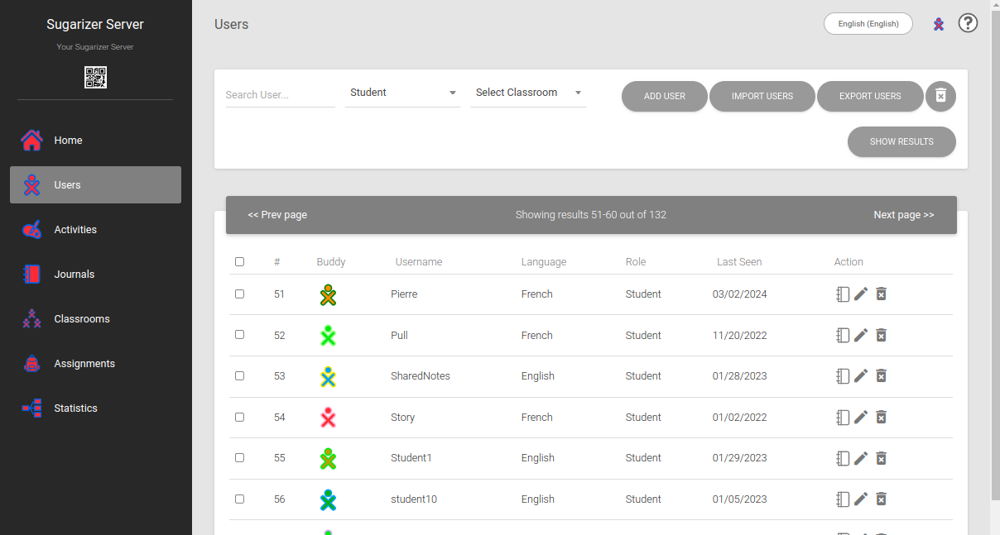
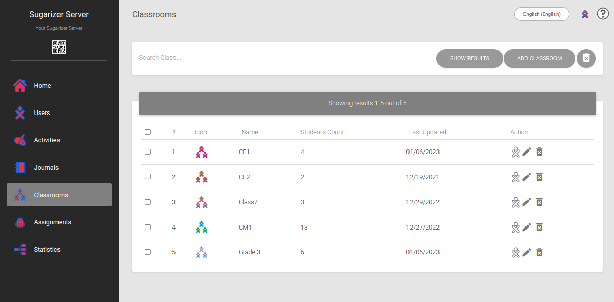
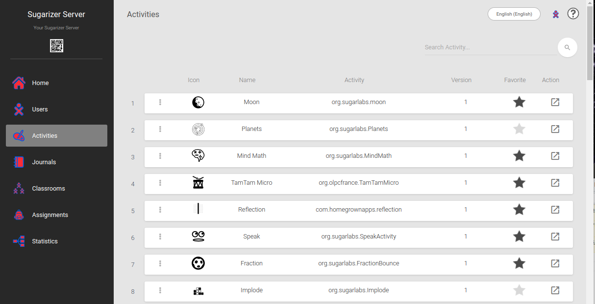
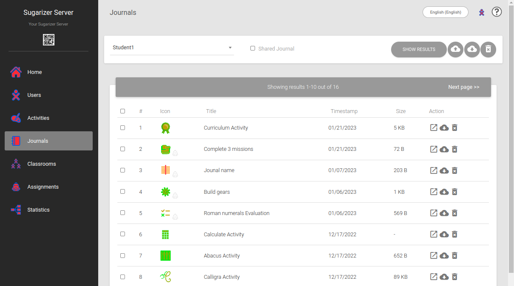
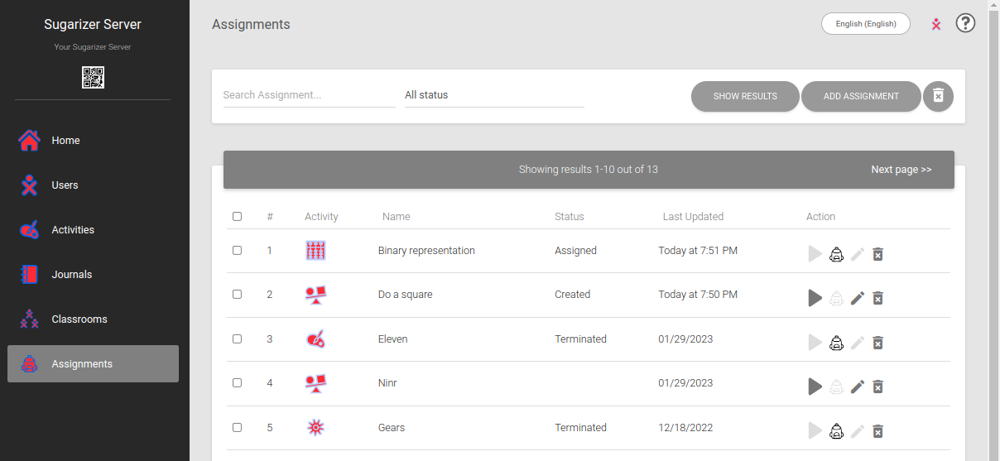
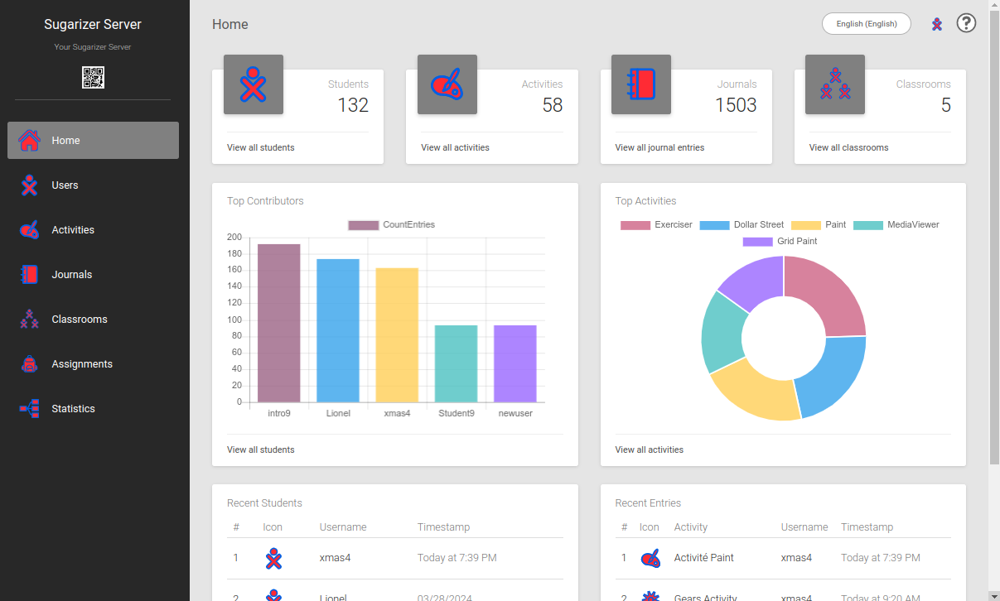
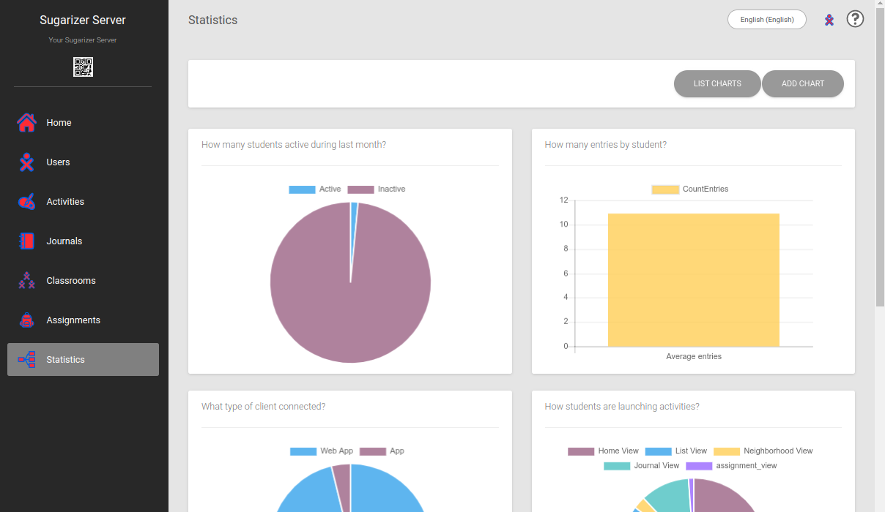

# Sugarizer Server dashboard overview

When deployed in the classroom, Sugarizer relies on a school server to enable teachers to track student progress, assign homework and manage activities. The Sugarizer Server dashboard is a powerful tool that enables teachers and administrators to manage learners and monitor Sugarizer platform activity in the school. Let's find out more.

## What's it for?

The Sugarizer Server dashboard is designed to meet 3 key deployment needs:

* Organize deployment
* Monitor activity
* Monitor deployment

## Organize deployment

Several dashboard features make it easy for you to organize the deployment of Sugarizer in a school, even if you have hundreds of users to manage:

1. **Create users: students and teachers** 
   * Allows administrators to create accounts in advance (no sign up required) for students and teachers on the platform.
   * Accounts can be created individually or in bulk via a CSV file.
   * Assign passwords and personalization (language, colors, etc.).

   
   
2. **Create classes and assign students and teachers to them**
   - Create classes to group students.
   - Assign one or more teachers to each class.
   - Create classes individually or in bulk via a CSV file.

   
   
3. **Select activities**
   - Allows administrators to select and customize the Sugarizer activities available on the platform according to pedagogical needs.
   - Customize the order and appearance of activities in the favorite view.

   

## Monitor activity

Monitor student activity is essential for assessing progress and engagement. Sugarizer Server's dashboard gives teachers insight into student activity and progress by monitoring Journal entries. Here are some key features:

1. **View Student Journal to measure progress**
   - Provides teachers with an overview of student activities and progress by monitoring Journal entries.
   - Activities can be reopened as they were left by students.

   

2. **Assign and monitor assignments**
   - Allows teachers to create assignments and measure their progress, providing personalized follow-up for students.
   - Organize assignments by class and student.
   - Individual or group follow-up of assignments.
   - Retrieve exercise grades.
   - Homework can be exported in CSV format.

   

## Monitor deployment

1. **Usage dashboard**
   - Provides administrators with detailed data on platform usage, including number of users, most popular activities, number of Journals and entries, etc.
   - Provides teachers with information on student engagement (most active and productive students) and the use of activities in their classes.

   

2. **Custom graphics**
   - Allows administrators to generate customized graphs based on server data, offering in-depth analysis of activity on the platform.

   

## Summary

In conclusion, with the Sugarizer Server Dashboard, Sugarizer is much more than just an educational app. It becomes a true monitoring platform for the classroom and the school. With its advanced user management, activity monitoring and reporting features, Sugarizer gives teachers and administrators the tools they need to optimize the educational experience.

## Learn more

* The Sugarizer Server setup procedure is available [here](https://github.com/llaske/sugarizer-server).
* You can test Sugarizer online [here](https://try.sugarizer.org) or download it [here](https://sugarizer.org/index.html#apps).