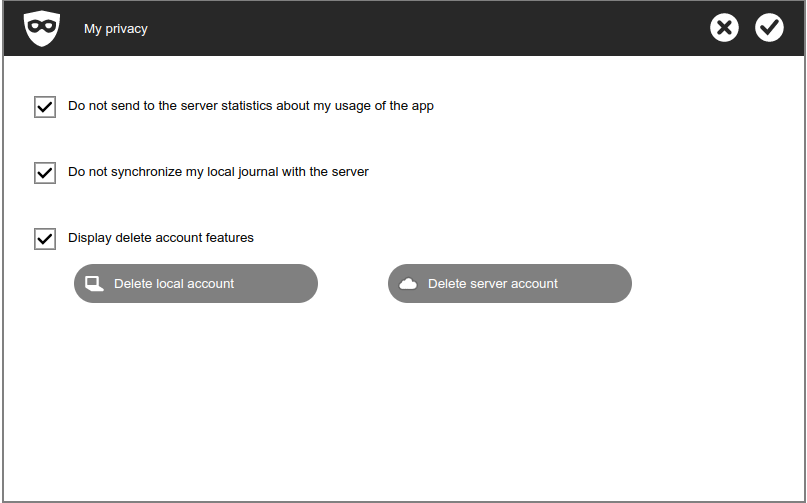
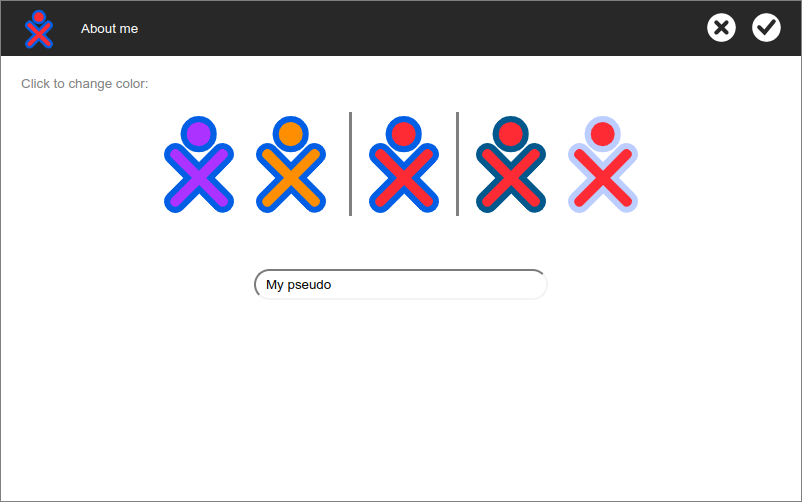
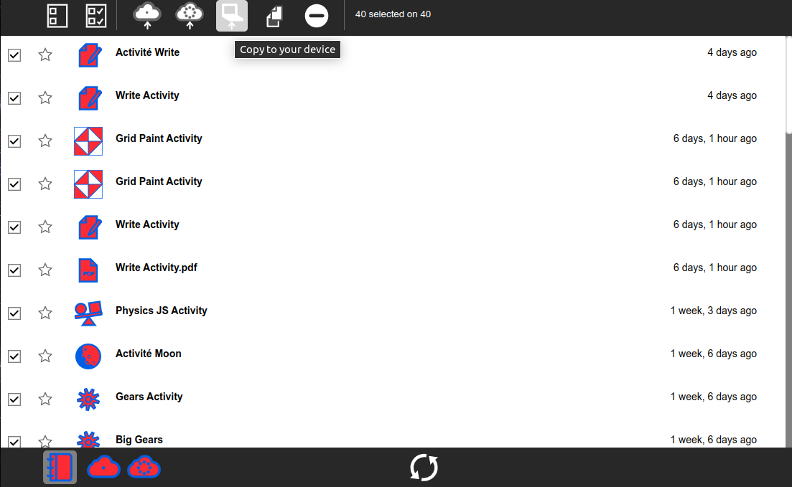
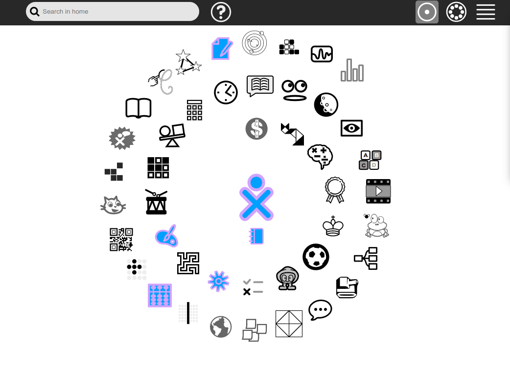

# Your privacy matters

In today's digital world, privacy is more important than ever, especially for children using educational platforms. Sugarizer, a learning platform designed for kids, is deeply committed to protecting user privacy and personal data. Here's an easy guide to understand how much privacy matters and how you can control it with Sugarizer.

   

## Why Privacy matters?

1. **Protecting personal information**: Personal data, such as usernames, preferences, and creative content, should be safeguarded to prevent misuse or unauthorized access.
2. **Maintaining trust**: Users, especially children and their parents, need to trust that their information is handled responsibly and securely.
3. **Ensuring safety**: Keeping data private reduces the risk of exposure to cyber threats and online predators.

## How Sugarizer handles your data

During your use of Sugarizer and its activities, you provide a variety of data that is collected and processed by the platform:

- **User information**: Everything related to your identification on the platform. It means your pseudo, password and preferences (language, colors, favorite activities).
- **Created content**: Everything you create in activities. It means drawings, documents, images, sounds, scores in activities, favorites (books, videos), and activity preferences.
- **Usage statistics**: Browser and device type, IP address, activity usage, and platform features accessed.

   

The way these data are collected and used depends on the mode you are using Sugarizer:

- **Installed and disconnected**: When Sugarizer is installed and used locally [not connected to a server](connectedmode_en.md), _no data is collected_. Everything stays on the device. It's the default mode when you install Sugarizer on your device.
- **Connected**: When using Sugarizer through a browser or connected to a Sugarizer server, the platform collects data to provide the services offered.

In this last case, the data collected are sent only to the Sugarizer Server you are connected to. If you are using a server at your school or a server you have installed yourself, the data is stored on this server and not shared with Sugarizer team.

## How to keep control of your data

Sugarizer ensures you have control over your data and provides you features to manage it:

- You can easily update your **User information** (change your pseudo, password, settings and preferences) through the preference settings dialog.

- Regarding your **Created content**, you can access and manage it through the Journal where you can view, download (in JSON format), or delete your content.

   

- About **Usage statistics**, you can disable usage statistics and content storage on the server via the privacy settings dialog.

   

- Finally, you can delete your account, all your content, and your usage statistics using the same privacy settings dialog.

By understanding and controlling your data, you can enjoy a safe and personalized learning experience with Sugarizer. Your privacy is our priority.

## Learn more

* Our [Privacy Policy](policy_en.md) provides detailed information on data collection, usage, and protection.
* If you have any questions about privacy or wish to exercise your data protection rights, contact us at [privacy@sugarizer.org](mailto:privacy@sugarizer.org).
* You can test Sugarizer online [here](https://try.sugarizer.org) or download it [here](https://sugarizer.org/index.html#apps).